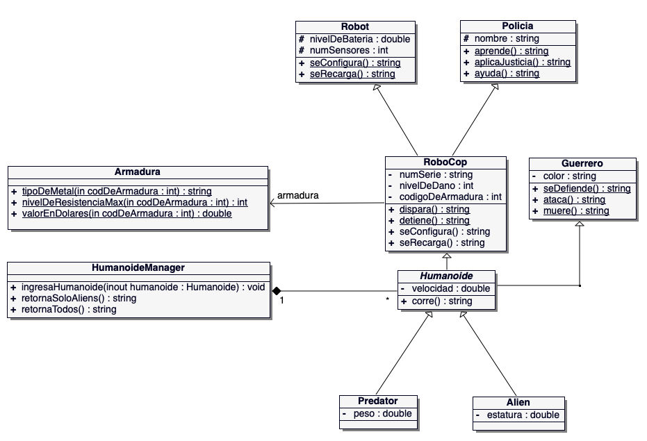

# Examen Parcial #1. Parte desarrollo #2

Usted ha sido contratado por una empresa que desarrolla software para juegos en línea. El equipo de programadores y diseñadores de esa empresa está proponiendo un juego que, en una de sus partes, necesita crear dos tipos de personajes tipo `Humanoides`, donde uno de ellos es de tipo `Alien` y el otro, de tipo `Predator`.  No obstante, para establecer la clase `Humanoide` debe existir previamente una jerarquía de clases. Después de un análisis exhaustivo, el equipo de diseñadores llegó a la conclusión y a esbozar el siguiente DRC (Diagrama de Relaciones de Clase):

Se puede observar en la anterior figura que la clase `Humanoide` (Abstract), genera dos subclases: tipo `Alien` y tipo `Predator`, que se requieren para el juego.  Además, la clase abstracta `Humanoide` hereda las características de dos clases que son: `RoboCop` y `Guerrero`, simultáneamente, la clase `RoboCop` hereda también las características de las clases: `Policía` y `Robot`.  En dicha figura, también se observan los UML de cada clase con sus respectivos atributos. 

Se observa también que la clase `RoboCop` depende de un tipo de armadura, motivo por el cuál existe una clase `Armadura` que suple esa necesidad. Por este motivo, la clase `RoboCop` tiene un atributo entero, llamado `codigDeArmadura`, que establece el tipo de armadura que el personaje usa en un momento dado.  Así que, si el personaje desea cambiar su armadura, por ejemplo, el programa puede contar con la siguiente tabla:

| codigDeArmadura  (valor-entero) | Tipo de metal  (mejorado) | Nivel de resistencia  (máxima de 0-100) | Valor en dólares  (millones) |
| :-----------------------------: | :-----------------------: | :-------------------------------------: | :--------------------------: |
|                1                |         Aluminio          |                   50                    |             2.5              |
|                2                |          Titanio          |                   95                    |             3.4              |
|                3                |           Acero           |                   85                    |             2.9              |
|                4                |            Oro            |                   70                    |             1.7              |

En el DRC, también se observa que existe una clase de un `Manager` tipo lista **(se puede implementar con nodos / std::vector)** donde se deben almacenar los diferentes objetos dinámicos humanoides que se puedan ir creando en la ejecución de la aplicación.  

Dado que usted es nuevo en la empresa, el equipo le ha asignado la tarea de programar este DRC en el lenguaje C++ en el editor de código disponible en un tiempo prudencial. 

Una vez implementado el modelo, usted deberá **correr las pruebas de unidad** necesarias para probar el sistema.  Es decir, con base en los métodos que existen en el `Manager`, el estudiante deberá realizar lo siguiente: 

​	a) Crear tres humanoides Alienígenas y dos Predators.

​	b) Luego crear un Manager tipo lista. 

​	c) Ingresar los cinco Humanoides creados en el Manager. 

​	d) Imprimir el listado de todos los humanoides que existen en el Manager. 

​	e) Imprimir solo lo Humanoides Alienígenas.

## **Aspectos para tomar en cuenta**.

1. Dado que, en el problema existe herencia múltiple, el estudiante deberá estudiar y realizar las modificaciones necesarias al DRC para implementarlo.
2. Se proporcionará una base programada (incompleta) de clases (.h) como apoyo para el examen.
3. No se podrán agregar más clases o más atributos, ni quitar clase o atributos.
4. La parte programada del examen [desarrollo] deberá compilar correctamente y correr mínimo en un 40% para ser calificado, en caso contrario tendrá nota cero (0).
5. Se deberá separar la definición (.h) del la implementación (.cpp).
6. En principio y para mejorar la eficiencia de la prueba del modelo, los siguientes atributos deberán ser inicializados en la clase a la que pertenecen, con los siguientes valores: 
   1. nivelBatería = 100;
   2. numDeSensores = 2000;
   3. color = “Negro plateado”; Obviamente la aplicación puede cambiar (“setear”) el valor del (los) atributo(s), después, si se desea.
7. Este examen debe estar dentro de un proyecto en el editor apropiado, además deberá subirlo al repositorio de Git asignado en el aula virtual institucional, o en última instancia solo en caso especial que no se pueda por razones técnicas y en coordinación con el profesor, subirlo como un archivo comprimido.
8. Es responsabilidad del estudiante, saber lo que comprime para que no se cometan errores de enviar algo que no se desea, al profesor.
9. Como la clase `Humanoide` es Abstracta, tendrá entre sus métodos, dos métodos virtuales puros, llamados:  **void setValor(double) = 0;** y otro  **string toString() = 0;**
10. Todas las clases a excepción de las clases: `HumanoideManager` y `Armadura`, tendrán tanto el Constructor por defecto como el parametrizado.

# Rúbrica de evaluación

| **Acción / método**                                          | **CLASE**         | **PTS** |
| ------------------------------------------------------------ | ----------------- | ------- |
| Colocación correcta de includes y herencias                  | Todas             | 10      |
| Establecer las asociaciones / depend. correctas              | Donde van.        | 8       |
| Constructor por Defecto y Parametrizado                      | Policía           | 2       |
| Constructor por Defecto y Parametrizado                      | Robot             | 2       |
| Constructor por Defecto y Parametrizado                      | Guerrero          | 2       |
| Constructor por Defecto y Parametrizado                      | RoboCop           | 2       |
| Constructor por Defecto y Parametrizado                      | Humanoide         | 3       |
| Constructor por Defecto y Parametrizado                      | Alien             | 3       |
| string seConfigura();                                        | RoboCop           | 2       |
| string seRecarga();                                          | RoboCop           | 2       |
| string tipoDeMetal(int);                                     | Armadura          | 3       |
| int nivelDeResistenciaMax(int);                              | Armadura          | 3       |
| double valorEnDolares(int);                                  | Armadura          | 3       |
| void setColor();                                             | Guerrero          | 2       |
| string ataca();                                              | Guerrero          | 2       |
| string retornaSoloAliens();                                  | HumanoideManager  | 4       |
| string retornaTodos();                                       | HumanoideManager  | 3       |
| string toString( )     Incluir todos los atributos e información de la armadura | Alien             | 4       |
| Compilación correcta y ejecución de las pruebas de unidad    | ExamenParcialTest | **10**  |

